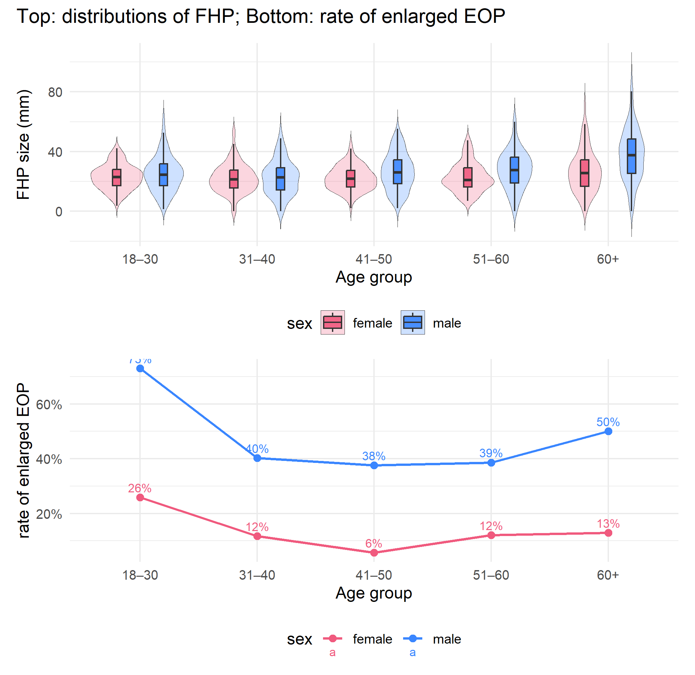
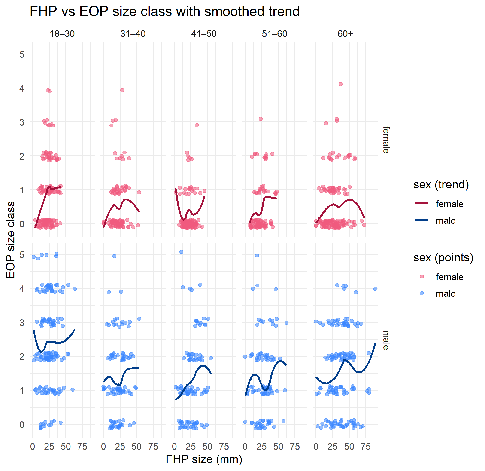

P8105 Midterm Project — hq2229
================
Hantang Qin
2025-10-22

We recreate key results from the paper. Using visualizations and simple
analyses, we evaluate whether the data support the authors’ hypothesis.

## Problem 1

``` r
raw <- read_excel("p8105_mtp_data.xlsx", skip = 8, na = c("", ".", "NA")) |>
  clean_names() |>
  mutate(row_id = row_number())
```

``` r
dat <- raw |>
  mutate(
    sex_lab = case_match(as.character(sex), "0" ~ "female", "1" ~ "male", .default = NA_character_),
    age_group_lab = case_match(
      as.character(age_group),
      "1" ~ "<18",
      "2" ~ "18–30", "3" ~ "31–40", "4" ~ "41–50", "5" ~ "51–60",
      c("6","7","8") ~ "60+",
      .default = NA_character_
    ),
    # Derive classes from continuous measures (do not overwrite originals)
    eop_size_class_derived = case_when(
      is.na(eop_size_mm) ~ NA_integer_,
      eop_size_mm < 5    ~ 1L,
      TRUE               ~ 2L
    ),
    fhp_cat_derived = case_when(
      is.na(fhp_size_mm) ~ NA_integer_,
      fhp_size_mm < 10   ~ 0L,
      fhp_size_mm < 20   ~ 1L,
      fhp_size_mm < 30   ~ 2L,
      fhp_size_mm < 40   ~ 3L,
      fhp_size_mm < 50   ~ 4L,
      fhp_size_mm < 60   ~ 5L,
      fhp_size_mm < 70   ~ 6L,
      TRUE               ~ 7L
    ),
    eop_size_num = suppressWarnings(as.integer(eop_size)),
    fhp_cat_num  = suppressWarnings(as.integer(fhp_category)),
    sex = factor(sex_lab, levels = c("female", "male")),
    age_group = factor(age_group_lab,
                       levels = c("<18","18–30","31–40","41–50","51–60","60+"),
                       ordered = TRUE),
    eop_size_f = factor(
      case_match(as.character(eop_size_num),
                 "0" ~ "0–5mm","1" ~ "5–10mm","2" ~ "10–15mm",
                 "3" ~ "15–20mm","4" ~ "20–25mm","5" ~ "≥25mm",
                 .default = NA_character_),
      levels = c("0–5mm","5–10mm","10–15mm","15–20mm","20–25mm","≥25mm"),
      ordered = TRUE
    ),
    fhp_cat_f = factor(
      case_match(as.character(fhp_cat_num),
                 "0" ~ "0–10mm","1" ~ "10–20mm","2" ~ "20–30mm","3" ~ "30–40mm",
                 "4" ~ "40–50mm","5" ~ "50–60mm","6" ~ "60–70mm","7" ~ "≥70mm",
                 .default = NA_character_),
      levels = c("0–10mm","10–20mm","20–30mm","30–40mm","40–50mm","50–60mm","60–70mm","≥70mm"),
      ordered = TRUE
    ),
    eop_visibility_classification = factor(
      as.integer(eop_visibility_classification),
      levels = c(0,1,2),
      labels = c("size = 0 mm", "0 < size < 5 mm", "size ≥ 5 mm"),
      ordered = TRUE
    )
  )

dat_work <- dat |>
  mutate(
    eop_size_class_use = coalesce(eop_size_num, eop_size_class_derived),
    fhp_cat_use        = coalesce(fhp_cat_num,  fhp_cat_derived)
  )
```

``` r
na_counts <- dat |>
  summarise(across(everything(), ~ sum(is.na(.))))
t(na_counts) |> as.data.frame() |> head(15)
```

    ##                                V1
    ## sex                             0
    ## age                             0
    ## age_group                       0
    ## eop_size_mm                   518
    ## eop_size                        0
    ## eop_visibility_classification   0
    ## eop_shape                     522
    ## fhp_size_mm                     6
    ## fhp_category                    0
    ## row_id                          0
    ## sex_lab                         0
    ## age_group_lab                   0
    ## eop_size_class_derived        518
    ## fhp_cat_derived                 6
    ## eop_size_num                    0

``` r
mismatch <- dat |>
  filter(
    (!is.na(eop_size_num) & eop_size_num != eop_size_class_derived) |
    (!is.na(fhp_cat_num)  & fhp_cat_num  != fhp_cat_derived)
  ) |>
  select(row_id, eop_size_mm, eop_size_num, eop_size_class_derived,
         fhp_size_mm, fhp_cat_num,  fhp_cat_derived)
head(mismatch, 10)
```

    ## # A tibble: 10 × 7
    ##    row_id eop_size_mm eop_size_num eop_size_class_derived fhp_size_mm
    ##     <int>       <dbl>        <int>                  <int>       <dbl>
    ##  1      2        17.1            3                      2        32.9
    ##  2      4        23.9            4                      2        11  
    ##  3      6         7.9            1                      2        27.6
    ##  4      7         6.4            1                      2        30.6
    ##  5      8         9.4            1                      2        27.8
    ##  6     10        16.5            3                      2        21  
    ##  7     11        22.8            4                      2        19.3
    ##  8     12        17.8            3                      2        17.5
    ##  9     20         9.6            1                      2        47.4
    ## 10     24         8.1            1                      2        34.5
    ## # ℹ 2 more variables: fhp_cat_num <int>, fhp_cat_derived <int>

``` r
n_participants <- nrow(dat)
glue("Participants: {n_participants}")
```

    ## Participants: 1221

``` r
tab_age_sex <- dat |>
  count(age_group, sex, name = "n") |>
  tidyr::complete(age_group, sex, fill = list(n = 0)) |>
  arrange(age_group, sex)
tab_age_sex
```

    ## # A tibble: 12 × 3
    ##    age_group sex        n
    ##    <ord>     <fct>  <int>
    ##  1 <18       female     1
    ##  2 <18       male       1
    ##  3 18–30     female   151
    ##  4 18–30     male     152
    ##  5 31–40     female   102
    ##  6 31–40     male     102
    ##  7 41–50     female   106
    ##  8 41–50     male     101
    ##  9 51–60     female    99
    ## 10 51–60     male     101
    ## 11 60+       female   155
    ## 12 60+       male     150

We imported the Excel (skipping header rows), standardized names, and
created **ordered factors** for sex, age group, EOP size class, FHP
category, and the 0–2 visibility scale. From the mm measures we
**derived** class variables without overwriting the originals and added
“working” columns that fall back to the derived values if a label is
missing. The dataset includes 1221 participants; the age–sex table above
summarizes sample composition. We also audited **mismatches** between
provided classes and those implied by mm values and listed examples. We
**note** these issues for interpretation but do not correct the data.

------------------------------------------------------------------------

## Problem 2

``` r
library(patchwork)

# adult-only column order
lvl_adults <- c("18–30","31–40","41–50","51–60","60+")

# custom palette (change these if you like)
pal <- c(female = "#F05A7E", male = "#3A86FF")

# helper: enlarged EOP = classes 2–5
is_enlarged <- function(x) as.integer(x) %in% 2:5
```

### Panel A+B

``` r
# Panel A: FHP distribution (violin + box), adults only
p_fhp_violin <-
  dat |>
  filter(!is.na(sex), !is.na(age_group), age_group != "<18", !is.na(fhp_size_mm)) |>
  mutate(age_group = forcats::fct_relevel(age_group, !!!lvl_adults)) |>
  ggplot(aes(x = age_group, y = fhp_size_mm, fill = sex)) +
  geom_violin(position = position_dodge(width = 0.8),
              alpha = 0.25, trim = FALSE, linewidth = 0) +
  geom_boxplot(width = 0.14, position = position_dodge(width = 0.8),
               outlier.shape = NA, alpha = 0.9) +
  scale_fill_manual(values = pal, guide = guide_legend(title = "sex")) +
  labs(title = NULL, x = "Age group", y = "FHP size (mm)") +
  theme_minimal(base_size = 12) +
  theme(legend.position = "bottom")

# Panel B: proportion enlarged EOP (classes 2–5), adults only
rate_df <-
  dat_work |>
  filter(!is.na(sex), !is.na(age_group), age_group != "<18") |>
  mutate(enlarged = is_enlarged(eop_size_class_use)) |>
  count(age_group, sex, enlarged, name = "n") |>
  group_by(age_group, sex) |>
  mutate(prop = n / sum(n)) |>
  ungroup() |>
  filter(enlarged) |>
  mutate(age_group = forcats::fct_relevel(age_group, !!!lvl_adults))

p_rate_lines <-
  rate_df |>
  ggplot(aes(x = age_group, y = prop, color = sex, group = sex)) +
  geom_line(linewidth = 0.8) +
  geom_point(size = 2.2) +
  geom_text(aes(label = scales::percent(prop, accuracy = 1)),
            vjust = -0.6, size = 3) +
  scale_color_manual(values = pal, guide = guide_legend(title = "sex")) +
  scale_y_continuous(labels = scales::percent_format()) +
  labs(x = "Age group", y = "rate of enlarged EOP") +
  theme_minimal(base_size = 12) +
  theme(legend.position = "bottom")

# Combine with title / subtitle
(p_fhp_violin / p_rate_lines) +
  plot_annotation(
    title = "Top: distributions of FHP; Bottom: rate of enlarged EOP",
    subtitle = NULL
  )
```

<!-- -->

### 2×5 grid

``` r
library(ggnewscale)

# palettes — tweak to whatever you like
pal_pts  <- c(female = "#F05A7E", male = "#3A86FF")  # point colors
pal_line <- c(female = "#A4133C", male = "#023E8A")  # darker line colors

dat_grid <- dat_work |>
  filter(!is.na(sex), !is.na(age_group), age_group != "<18",
         !is.na(fhp_size_mm), !is.na(eop_size_class_use)) |>
  mutate(
    age_group = forcats::fct_relevel(age_group, "18–30","31–40","41–50","51–60","60+"),
    eop_class = factor(eop_size_class_use, levels = 0:5, labels = c("0","1","2","3","4","5"))
  )

ggplot(dat_grid, aes(x = fhp_size_mm, y = as.numeric(eop_class))) +
  # --- points (own color scale) ---
  geom_point(
    aes(color = sex),
    alpha = 0.55, size = 1.6,
    position = position_jitter(height = 0.12, width = 0)  # spread out vertically (like original)
  ) +
  scale_color_manual(values = pal_pts, guide = guide_legend(title = "sex (points)")) +

  # start a NEW color scale just for the trend lines
  ggnewscale::new_scale_color() +

  # --- trend lines (own color scale) ---
  geom_smooth(
    aes(color = sex),
    method = "loess", span = 0.8, se = FALSE, linewidth = 0.9
  ) +
  scale_color_manual(values = pal_line, guide = guide_legend(title = "sex (trend)")) +

  # keep class labels on the Y axis
  scale_y_continuous(breaks = 1:6, labels = levels(dat_grid$eop_class)) +

  facet_grid(sex ~ age_group, drop = TRUE) +
  labs(
    title = "FHP vs EOP size class with smoothed trend",
    x = "FHP size (mm)", y = "EOP size class"
  ) +
  theme_minimal(base_size = 12) +
  theme(legend.position = "right")
```

<!-- -->

Plot 1. Distributions are similar across ages, but males show slightly
larger FHP values than females, with the biggest gap in the 60+ group.
Plot 2. Males have higher enlarged-EOP rates (classes 2–5) in every age
group; their prevalence rises modestly with age to ~50% in the oldest
group, while female rates stay around 10–25%. Grid. Within sex × age
strata, higher FHP is associated with higher EOP class; the tendency is
mild for males and weak for females. Figures use proportions (not
counts), adult groups, jitter to show overlap, and a light LOESS trend
to summarize within-stratum patterns.

## Problem 3

``` r
# overall mean ± SD of FHP
fhp_overall <- dat |>
  summarise(
    mean_fhp = mean(fhp_size_mm, na.rm = TRUE),
    sd_fhp   = sd(fhp_size_mm, na.rm = TRUE),
    n_fhp    = sum(!is.na(fhp_size_mm))
  )

# age-group counts
age_counts <- dat |>
  count(age_group, name = "n") |>
  mutate(age_group = forcats::fct_relevel(age_group, "<18","18–30","31–40","41–50","51–60","60+")) |>
  arrange(age_group)

# EEOP prevalence (classes 2–5)
eeop_prev <- dat_work |>
  summarise(
    prop_eeop = mean(eop_size_class_use %in% 2:5, na.rm = TRUE),
    pct_eeop  = percent(prop_eeop)
  )

eeop_ci <- dat_work |>
  summarise(
    n = sum(!is.na(eop_size_class_use)),
    p = mean(eop_size_class_use %in% 2:5, na.rm = TRUE)
  ) |>
  mutate(
    se = sqrt(p * (1 - p) / n),
    lo = pmax(0, p - 1.96 * se),
    hi = pmin(1, p + 1.96 * se),
    p_txt  = scales::percent(p),
    lo_txt = scales::percent(lo),
    hi_txt = scales::percent(hi)
  )
# among 60+, proportion with FHP > 40 mm
over40_60 <- dat |>
  filter(age_group == "60+") |>
  summarise(
    prop_over40 = mean(fhp_size_mm > 40, na.rm = TRUE),
    pct_over40  = percent(prop_over40),
    n_60p       = sum(!is.na(fhp_size_mm))
  )

list("FHP overall mean/SD" = fhp_overall,
     "Age-group counts"    = age_counts,
     "EEOP prevalence"     = eeop_prev,
     "60+ with FHP>40mm"   = over40_60)
```

    ## $`FHP overall mean/SD`
    ## # A tibble: 1 × 3
    ##   mean_fhp sd_fhp n_fhp
    ##      <dbl>  <dbl> <int>
    ## 1     26.1   13.0  1215
    ## 
    ## $`Age-group counts`
    ## # A tibble: 6 × 2
    ##   age_group     n
    ##   <ord>     <int>
    ## 1 <18           2
    ## 2 18–30       303
    ## 3 31–40       204
    ## 4 41–50       207
    ## 5 51–60       200
    ## 6 60+         305
    ## 
    ## $`EEOP prevalence`
    ## # A tibble: 1 × 2
    ##   prop_eeop pct_eeop
    ##       <dbl> <chr>   
    ## 1     0.322 32%     
    ## 
    ## $`60+ with FHP>40mm`
    ## # A tibble: 1 × 3
    ##   prop_over40 pct_over40 n_60p
    ##         <dbl> <chr>      <int>
    ## 1       0.326 33%          304

*Reproduction summary.* Age‐group counts (table above) match the adult
distribution in the report. The overall FHP mean±SD is **26.1 ± 13 mm**.
Using the class definition for EEOP (EOP classes **2–5**), the estimated
prevalence is **32%**. Among the **60+** group, **33%** have **FHP \> 40
mm**, the highest by age.

*EEOP is defined as EOP classes 2–5 (≥10 mm). The 95% Wald CI for the
EEOP proportion is (**30%**, **35%**), and the point estimate **32%**
lies within this interval.*

Small gaps from the paper likely reflect class boundary choices (e.g.,
treatment of exactly 10 mm), missingness, and rounding. Because the data
are observational and cross-sectional, results indicate association—not
causation—and the FHP–EOP tendency appears **weak and strata-dependent**
(stronger in males than females).
